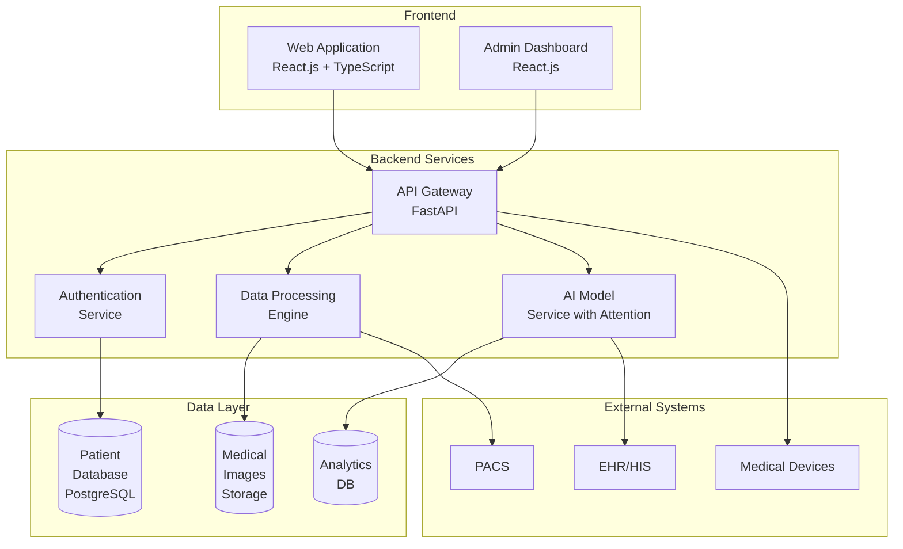
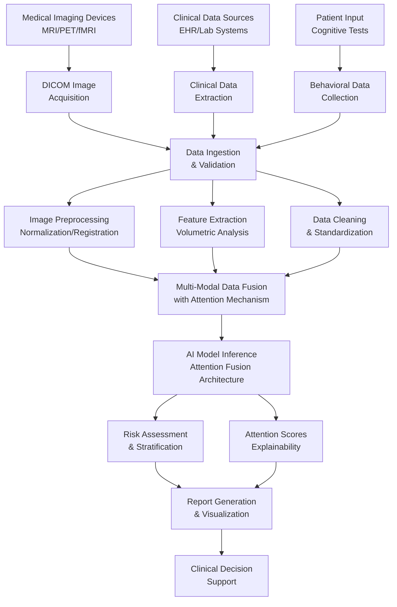
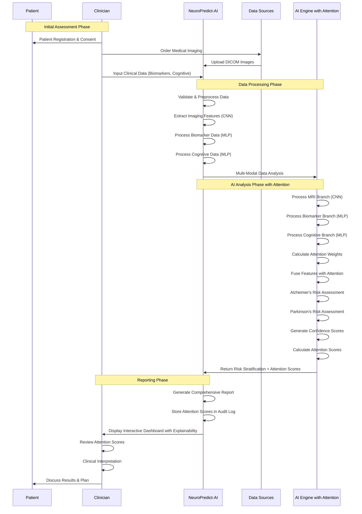
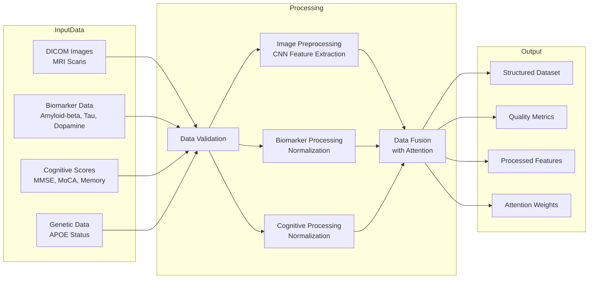
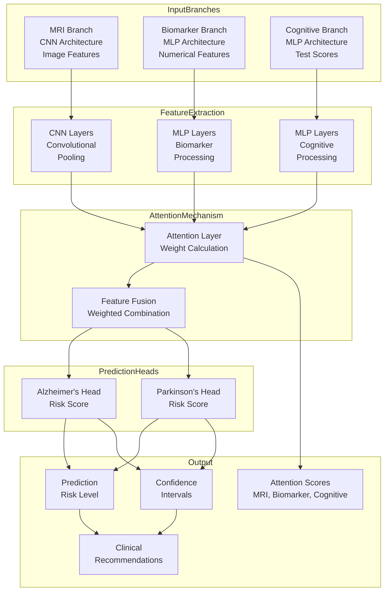
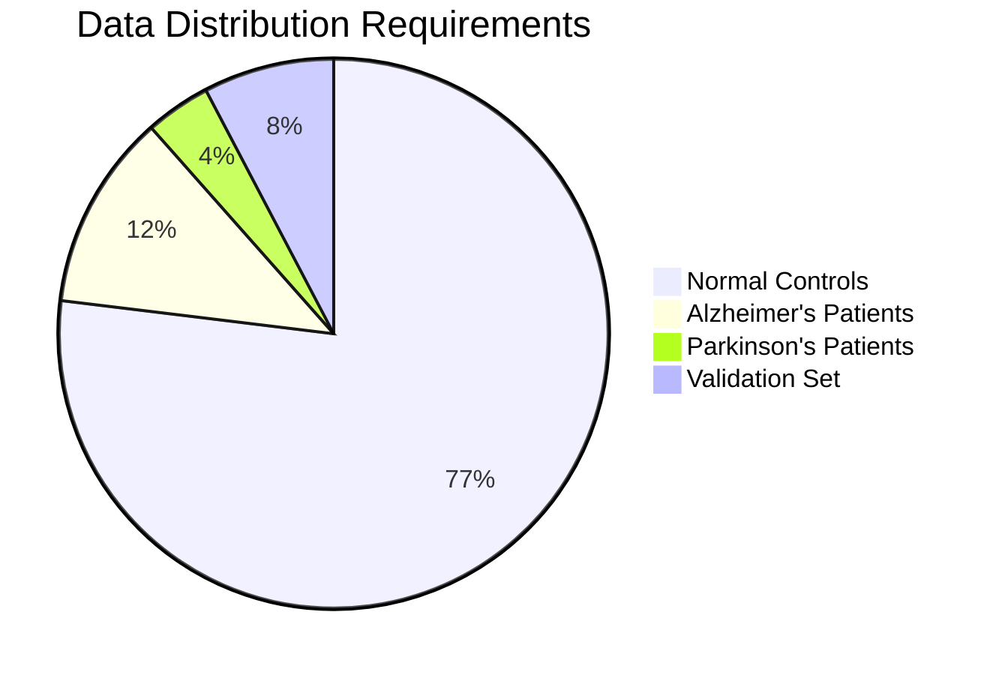
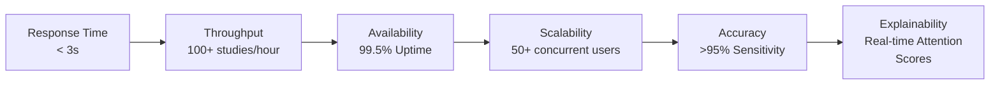
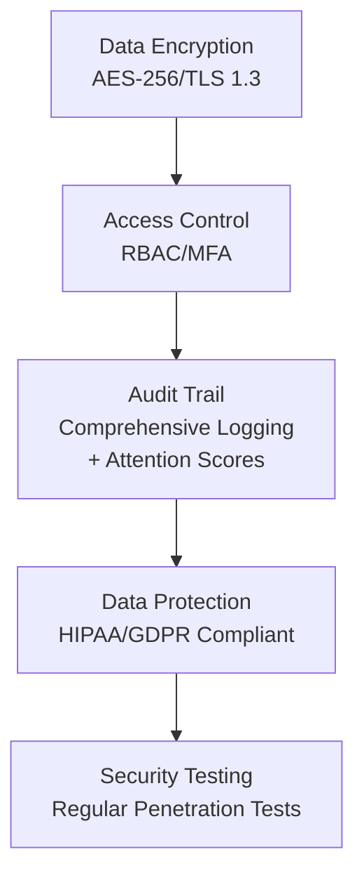
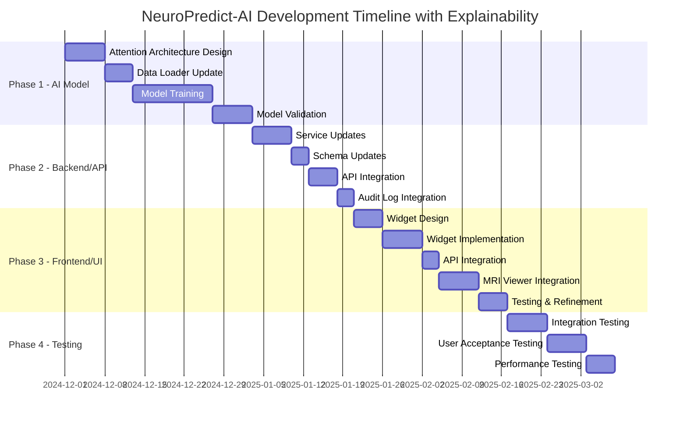
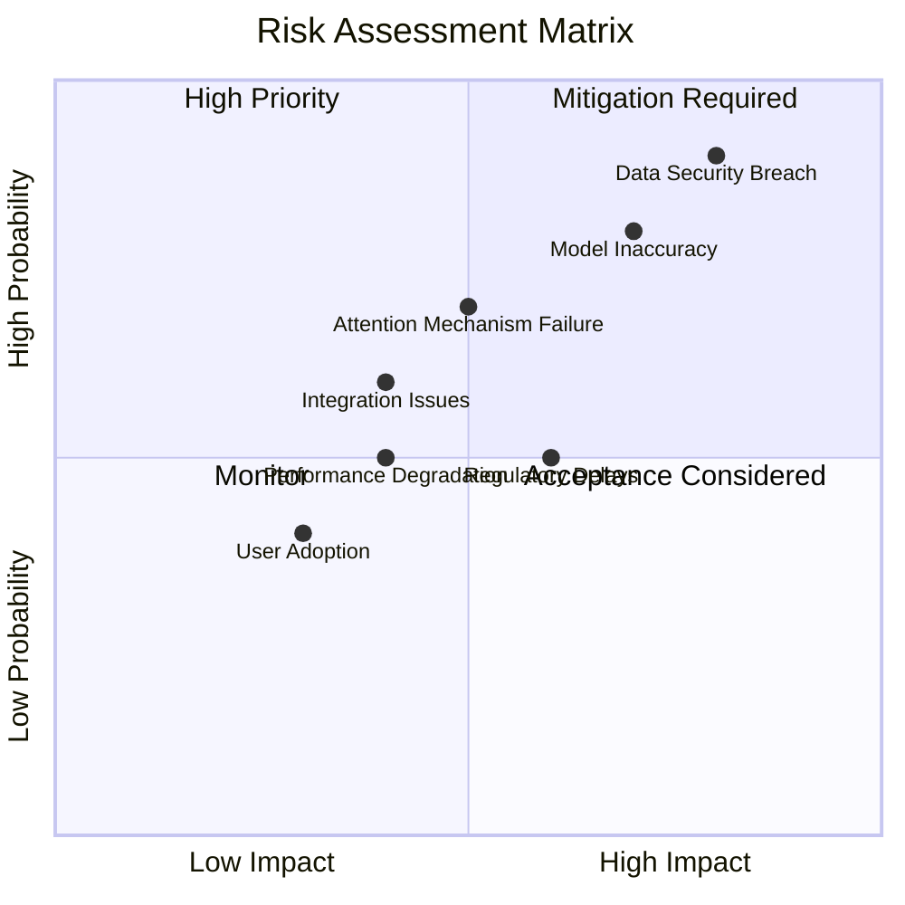

🧠 NeuroPredict-AI
# Software Requirements Specification (SRS)
# NeuroPredict-AI: Alzheimer's and Parkinson's Prediction and Risk Assessment Software

## Document Control

| **Version** | **Date** | **Author** | **Changes** |
|-------------|----------|------------|-------------|
| 1.0 | 2024-11-20 | AI Development Team | Initial Release with Complete Diagrams |
| 1.1 | 2024-11-20 | AI Development Team | Added Architectural Details |
| 2.0 | 2024-12-XX | AI Development Team | Added Attention Fusion Architecture & Explainability Features |

---

## 1. Introduction

### 1.1 Purpose
NeuroPredict-AI is an advanced clinical decision support system designed to assist healthcare professionals in early detection and risk assessment of Alzheimer's and Parkinson's diseases through artificial intelligence and multimodal data analysis. This document specifies the complete requirements for the system, including the newly added attention fusion architecture for model explainability.

### 1.2 Scope
The system provides AI-powered risk stratification with explainable AI capabilities, enabling clinicians to understand the contribution of each data modality (MRI, biomarkers, cognitive data) to the final prediction. The system should be used as a supplementary tool alongside clinical judgment, not as a standalone diagnostic system.

### 1.3 Intended Audience
- Medical Professionals (Neurologists, Radiologists)
- Software Development Teams
- Project Stakeholders
- Quality Assurance Teams
- Regulatory Compliance Officers
- AI/ML Engineers

### 1.4 Document Structure
This SRS document is organized into the following sections:
- **Section 2**: System Architecture (including new Attention Fusion Architecture)
- **Section 3**: Detailed System Components
- **Section 4**: Functional Requirements (including new explainability features)
- **Section 5**: Non-Functional Requirements
- **Section 6**: Implementation Phases (including new 3-phase implementation plan)
- **Section 7**: Risk Assessment
- **Section 8**: Compliance & Regulatory Requirements

---

## 2. System Architecture

### 2.1 High-Level System Architecture



### 2.2 Data Flow Architecture



### 2.3 Diagnosis Process Workflow



---

## 3. Detailed System Components

### 3.1 Data Processing Pipeline



### 3.2 AI Model Architecture - Attention Fusion



### 3.3 Attention Fusion Architecture Details

#### 3.3.1 Architecture Components

**MRI Branch (CNN):**
- Input: Preprocessed MRI images (3D volumes or 2D slices)
- Architecture: Convolutional layers with batch normalization
- Output: Feature vector (e.g., 256 dimensions)

**Biomarker Branch (MLP):**
- Input: Numerical biomarker values (Amyloid-beta, Tau, Dopamine)
- Architecture: Multi-layer perceptron with dropout
- Output: Feature vector (e.g., 128 dimensions)

**Cognitive Branch (MLP):**
- Input: Cognitive test scores (MMSE, MoCA, Memory, Attention, Executive Function)
- Architecture: Multi-layer perceptron with dropout
- Output: Feature vector (e.g., 128 dimensions)

**Attention Layer:**
- Input: Concatenated or separate feature vectors from three branches
- Mechanism: Self-attention or cross-attention
- Output: Attention weights for each branch + Fused feature vector

**Prediction Heads:**
- Alzheimer's Head: Binary classification (risk score 0-1)
- Parkinson's Head: Binary classification (risk score 0-1)

#### 3.3.2 Attention Mechanism Implementation

The attention mechanism calculates weights α_MRI, α_Biomarker, α_Cognitive such that:
- α_MRI + α_Biomarker + α_Cognitive = 1.0
- Each weight represents the relative importance of that modality in the final prediction
- Weights are learned during training and can be extracted for explainability

---

## 4. Functional Requirements

### 4.1 Core System Functions

| **Module** | **Function ID** | **Description** | **Priority** |
|------------|-----------------|-----------------|--------------|
| User Management | FR-01 | Role-based access control with multi-factor authentication | High |
| Data Management | FR-02 | Secure DICOM upload and clinical data integration | High |
| Image Processing | FR-03 | Automated preprocessing and quality assessment | High |
| AI Analysis | FR-04 | Multi-modal risk prediction with confidence scoring | High |
| **AI Explainability** | **FR-04.1** | **Attention-based explainability with modality scores** | **High** |
| Reporting | FR-05 | Comprehensive report generation with visualization | High |
| Integration | FR-06 | HL7/FHIR API for EHR/PACS integration | Medium |

### 4.2 Phase 1: AI Model Development (Backend/ML)

#### 4.2.1 FR-P1-01: Attention Fusion Architecture Implementation

**Description:** Implement a multi-branch neural network architecture with attention mechanism for combining MRI, biomarker, and cognitive data.

**Requirements:**
- **MRI Branch (CNN):**
  - Accept preprocessed MRI images as input
  - Use convolutional layers for feature extraction
  - Output feature vector of fixed dimension (e.g., 256)
  
- **Biomarker Branch (MLP):**
  - Accept numerical biomarker values (Amyloid-beta, Tau, Dopamine)
  - Use multi-layer perceptron for feature processing
  - Output feature vector of fixed dimension (e.g., 128)
  
- **Cognitive Branch (MLP):**
  - Accept cognitive test scores (MMSE, MoCA, Memory, Attention, Executive Function)
  - Use multi-layer perceptron for feature processing
  - Output feature vector of fixed dimension (e.g., 128)
  
- **Attention Layer:**
  - Calculate attention weights for each branch
  - Combine features using weighted sum based on attention weights
  - Ensure attention weights sum to 1.0
  
- **Prediction Heads:**
  - Separate heads for Alzheimer's and Parkinson's prediction
  - Output risk scores (0-1 probability)

**Files:**
- `backend/app/services/ai_model_service.py` - Model architecture definition
- `backend/scripts/train_model.py` - Training script
- `backend/app/services/training/trainer.py` - Training logic

**Acceptance Criteria:**
- Model architecture successfully defined with three branches
- Attention mechanism correctly calculates and applies weights
- Model can be trained end-to-end
- Attention weights are extractable from trained model

#### 4.2.2 FR-P1-02: Data Loader Update

**Description:** Update data loader to handle simultaneous loading and preprocessing of MRI images, biomarker data, and cognitive data.

**Requirements:**
- Load MRI images from storage (DICOM or preprocessed .npy files)
- Load biomarker data from database or CSV
- Load cognitive data from database or CSV
- Synchronize data by patient ID
- Apply appropriate preprocessing to each modality
- Return batched data for training

**Files:**
- `backend/app/services/data_loader.py` (to be created or updated)
- `backend/app/services/image_processing_service.py` - MRI preprocessing

**Acceptance Criteria:**
- Data loader can load all three modalities simultaneously
- Data is properly synchronized by patient ID
- Preprocessing is applied correctly to each modality
- Batches are created for training

#### 4.2.3 FR-P1-03: Model Training and Validation

**Description:** Implement training logic with validation metrics including attention weight distribution.

**Requirements:**
- Training loop with proper loss functions
- Validation metrics: Accuracy, AUC-ROC
- **New Metric:** Attention Weight Distribution validation
  - Monitor distribution of attention weights during training
  - Ensure no single branch dominates (unless clinically justified)
  - Track attention weight stability across epochs
- Model checkpointing
- Early stopping based on validation metrics

**Files:**
- `backend/scripts/train_model.py` - Main training script
- `backend/app/services/training/trainer.py` - Training logic
- `backend/app/services/training/evaluator.py` - Evaluation metrics

**Acceptance Criteria:**
- Model trains successfully with all three branches
- Validation metrics are calculated correctly
- Attention weight distribution is monitored and logged
- Model checkpoints are saved correctly

#### 4.2.4 FR-P1-04: Model Output Standardization

**Description:** Standardize model output to include prediction and attention scores.

**Requirements:**
- Model output structure:
  ```python
  {
      'prediction': float,  # Final risk score (0-1)
      'attention_scores': {
          'MRI': float,      # Attention weight for MRI (0-1)
          'Biomarker': float, # Attention weight for Biomarker (0-1)
          'Cognitive': float  # Attention weight for Cognitive (0-1)
      }
  }
  ```
- Ensure attention scores sum to 1.0
- Save model with metadata including architecture version

**Files:**
- `backend/app/services/ai_model_service.py` - Model inference
- Model serialization (`.pkl` or PyTorch `.pt` format)

**Acceptance Criteria:**
- Model returns standardized output format
- Attention scores are always present and sum to 1.0
- Model can be loaded and used for inference

### 4.3 Phase 2: Backend Service and API Updates

#### 4.3.1 FR-P2-01: AI Model Service Update

**Description:** Update AI model service to return attention scores along with predictions.

**Requirements:**
- Modify `predict()` method to extract attention scores from model
- Include attention scores in response dictionary
- Maintain backward compatibility where possible

**Files:**
- `backend/app/services/ai_model_service.py`

**Response Structure:**
```python
{
    'alzheimer': {
        'risk_score': float,
        'risk_level': RiskLevel,
        'confidence': float
    },
    'parkinson': {
        'risk_score': float,
        'risk_level': RiskLevel,
        'confidence': float
    },
    'attention_scores': {
        'MRI': float,
        'Biomarker': float,
        'Cognitive': float
    },
    'feature_importance': Dict[str, float],
    'recommendations': str,
    'model_version': str,
    'model_name': str
}
```

**Acceptance Criteria:**
- `predict()` method returns attention scores
- Attention scores are correctly extracted from model
- Response structure matches specification

#### 4.3.2 FR-P2-02: Prediction Schema Update

**Description:** Update Pydantic schemas to include explainability scores.

**Requirements:**
- Add `explainability_scores` or `attention_scores` field to `PredictionResponse`
- Field type: `Dict[str, float]` or JSON
- Include in API documentation

**Files:**
- `backend/app/schemas/prediction.py`

**Schema Update:**
```python
class PredictionResponse(BaseModel):
    # ... existing fields ...
    attention_scores: Optional[Dict[str, float]] = Field(
        None,
        description="Attention weights for each data modality (MRI, Biomarker, Cognitive)"
    )
    explainability_scores: Optional[Dict[str, float]] = Field(
        None,
        alias="attention_scores",
        description="Alias for attention_scores for backward compatibility"
    )
```

**Acceptance Criteria:**
- Schema includes attention_scores field
- Field is properly validated
- API documentation is updated

#### 4.3.3 FR-P2-03: API Endpoint Update

**Description:** Update prediction API endpoint to return attention scores.

**Requirements:**
- Modify `/api/v1/predictions/` POST endpoint
- Include attention scores in response
- Update OpenAPI/Swagger documentation

**Files:**
- `backend/app/api/predictions.py`

**Acceptance Criteria:**
- API endpoint returns attention scores
- Response matches updated schema
- API documentation is accurate

#### 4.3.4 FR-P2-04: Audit Log Integration

**Description:** Store attention scores in audit log for compliance and tracking.

**Requirements:**
- Log attention scores with each prediction
- Include in audit log entry details
- Enable querying by attention score ranges

**Files:**
- `backend/app/models/audit.py` - Audit log model
- `backend/app/services/audit_service.py` - Audit logging service
- `backend/app/api/predictions.py` - Prediction endpoint

**Audit Log Entry:**
```python
{
    'action': 'create_prediction',
    'resource_type': 'prediction',
    'resource_id': prediction_id,
    'details': {
        'attention_scores': {
            'MRI': float,
            'Biomarker': float,
            'Cognitive': float
        },
        'risk_scores': {...},
        # ... other details
    }
}
```

**Acceptance Criteria:**
- Attention scores are logged with predictions
- Audit log entries are queryable
- Compliance requirements are met

### 4.4 Phase 3: Frontend/UI Development

#### 4.4.1 FR-P3-01: Explainability Widget Design

**Description:** Design and implement visual widget for displaying attention scores.

**Requirements:**
- **Visualization Options:**
  - Bar chart showing attention scores for MRI, Biomarker, Cognitive
  - Radar chart for multi-dimensional view
  - Color coding: High importance (red/orange), Medium (yellow), Low (green)
  - Text labels: "High Importance", "Medium Importance", "Low Importance"
  
- **Widget Location:**
  - Display on `PredictionResultPage.tsx`
  - Position: Above or alongside risk assessment cards
  - Responsive design for mobile/tablet/desktop

**Files:**
- `frontend/src/pages/PredictionResultPage.tsx`
- `frontend/src/components/ExplainabilityWidget.tsx` (new component)

**Widget Design:**
```typescript
interface ExplainabilityWidgetProps {
  attentionScores: {
    MRI: number;
    Biomarker: number;
    Cognitive: number;
  };
}
```

**Acceptance Criteria:**
- Widget displays attention scores visually
- Color coding is intuitive
- Widget is responsive
- Accessibility requirements met (WCAG 2.1)

#### 4.4.2 FR-P3-02: API Integration Update

**Description:** Update frontend to fetch and display attention scores from API.

**Requirements:**
- Update API call in `PredictionResultPage.tsx`
- Parse `attention_scores` from API response
- Handle missing attention scores gracefully
- Display loading state while fetching

**Files:**
- `frontend/src/pages/PredictionResultPage.tsx`
- `frontend/src/services/api.ts` - API service (if needed)

**Acceptance Criteria:**
- Frontend correctly fetches attention scores
- Missing scores are handled gracefully
- Loading states are displayed appropriately

#### 4.4.3 FR-P3-03: MRI Viewer Integration

**Description:** Integrate attention scores with MRI viewer for region highlighting.

**Requirements:**
- When user clicks on "MRI Importance" in explainability widget:
  - Highlight relevant brain regions in MRI viewer
  - Show regions of interest (e.g., Hippocampus, Amygdala)
  - Display overlay with attention weight value
  - Animate highlight for better visibility

**Files:**
- `frontend/src/components/MRIViewer.tsx`
- `frontend/src/components/ExplainabilityWidget.tsx`
- `frontend/src/services/image_processing.ts` (if needed for region detection)

**Note:** This feature requires additional development in image processing service to:
- Detect and map brain regions in MRI images
- Associate regions with attention weights
- Generate overlay masks for highlighting

**Acceptance Criteria:**
- Clicking MRI importance highlights regions in viewer
- Overlay is visually clear
- Performance is acceptable (< 1s for highlight)

### 4.5 Data Requirements Specification



---

## 5. Non-Functional Requirements

### 5.1 Performance Metrics



**Additional Performance Requirements for Attention Mechanism:**
- Attention score calculation: < 100ms overhead
- Model inference with attention: < 3s total
- Frontend widget rendering: < 500ms

### 5.2 Security Framework



### 5.3 Explainability Requirements

- **Transparency:** Attention scores must be human-interpretable
- **Consistency:** Similar cases should have similar attention distributions
- **Documentation:** Attention mechanism must be documented for regulatory review
- **Validation:** Attention weights should be validated against clinical knowledge

---

## 6. Implementation Phases

### 6.1 Phase 1: AI Model Development (Backend/ML)

**Timeline:** 4-6 weeks

**Tasks:**
1. Design and implement Attention Fusion Architecture
2. Update data loader for multi-modal data
3. Implement training pipeline with attention weight monitoring
4. Standardize model output format
5. Train and validate model
6. Document architecture and training process

**Deliverables:**
- Trained model with attention mechanism
- Updated data loader
- Training scripts and documentation
- Model evaluation reports

### 6.2 Phase 2: Backend Service and API Updates

**Timeline:** 2-3 weeks

**Tasks:**
1. Update AI model service to return attention scores
2. Update prediction schemas
3. Update API endpoints
4. Integrate with audit logging
5. Update API documentation

**Deliverables:**
- Updated backend services
- Updated API endpoints
- Updated API documentation
- Audit log integration

### 6.3 Phase 3: Frontend/UI Development

**Timeline:** 3-4 weeks

**Tasks:**
1. Design explainability widget
2. Implement widget component
3. Integrate with API
4. Implement MRI viewer integration (if applicable)
5. User testing and refinement

**Deliverables:**
- Explainability widget component
- Updated prediction results page
- MRI viewer integration (if applicable)
- User documentation

### 6.4 Overall Project Timeline



---

## 7. Risk Assessment

### 7.1 Risk Matrix



### 7.2 New Risks for Attention Mechanism

**Risk: Attention Weights Not Interpretable**
- **Probability:** Medium
- **Impact:** High
- **Mitigation:** Validate against clinical knowledge, provide documentation

**Risk: Model Performance Degradation**
- **Probability:** Medium
- **Impact:** High
- **Mitigation:** A/B testing, baseline comparison, early stopping

**Risk: Computational Overhead**
- **Probability:** Low
- **Impact:** Medium
- **Mitigation:** Optimize attention calculation, use efficient implementations

---

## 8. Compliance & Regulatory Requirements

### 8.1 Standards Compliance
- **FDA**: 21 CFR Part 11, 510(k) Clearance
- **Medical Devices**: ISO 13485, IEC 62304
- **Data Protection**: HIPAA, GDPR, CCPA
- **Interoperability**: HL7 FHIR R4, DICOM
- **AI/ML Explainability**: FDA AI/ML Software as a Medical Device (SaMD) Action Plan

### 8.2 Explainability Compliance

**Regulatory Requirements:**
- Model decisions must be explainable to clinicians
- Attention scores provide interpretability
- Documentation must describe attention mechanism
- Validation studies must demonstrate clinical utility of attention scores

**Documentation Requirements:**
- Architecture diagrams
- Attention mechanism mathematical description
- Training procedure documentation
- Validation results with attention weight analysis

---

## 9. Testing Requirements

### 9.1 Unit Testing
- Test each branch of attention architecture independently
- Test attention weight calculation
- Test model output format
- Test data loader for all modalities

### 9.2 Integration Testing
- Test end-to-end prediction flow with attention scores
- Test API response format
- Test audit log integration
- Test frontend-backend integration

### 9.3 Validation Testing
- Validate attention weights sum to 1.0
- Validate attention scores are in range [0, 1]
- Validate model performance with attention mechanism
- Validate explainability widget displays correctly

### 9.4 Clinical Validation
- Validate attention scores against clinical knowledge
- Validate that high-attention modalities align with clinical expectations
- User acceptance testing with clinicians

---

## 10. Documentation Requirements

### 10.1 Technical Documentation
- Architecture documentation for attention fusion
- API documentation with attention scores
- Training procedure documentation
- Model versioning and deployment guide

### 10.2 User Documentation
- User guide for explainability widget
- Interpretation guide for attention scores
- Clinical decision support documentation

### 10.3 Regulatory Documentation
- Model card with attention mechanism details
- Validation study reports
- Risk assessment documentation

---

## 11. Glossary

**Attention Mechanism:** A neural network component that learns to assign importance weights to different input features or modalities.

**Attention Scores:** Numerical values (0-1) representing the relative importance of each data modality (MRI, Biomarker, Cognitive) in the final prediction.

**Attention Fusion Architecture:** A multi-branch neural network architecture that combines features from different modalities using an attention mechanism.

**Explainability:** The ability to understand and interpret how an AI model makes predictions.

**Modality:** A type of medical data (e.g., MRI images, biomarker values, cognitive test scores).

**Branch:** A separate neural network pathway in a multi-modal architecture that processes one type of input data.

---

## 12. Appendices

### Appendix A: Model Output Schema

```json
{
  "prediction": 0.75,
  "attention_scores": {
    "MRI": 0.45,
    "Biomarker": 0.35,
    "Cognitive": 0.20
  }
}
```

### Appendix B: API Response Example

```json
{
  "id": 123,
  "patient_id": 456,
  "alzheimer_prediction": {
    "risk_score": 0.75,
    "risk_level": "high",
    "confidence": 0.85
  },
  "parkinson_prediction": {
    "risk_score": 0.30,
    "risk_level": "low",
    "confidence": 0.80
  },
  "attention_scores": {
    "MRI": 0.45,
    "Biomarker": 0.35,
    "Cognitive": 0.20
  },
  "feature_importance": {...},
  "recommendations": "...",
  "created_at": "2024-12-01T10:00:00Z"
}
```

### Appendix C: Attention Mechanism Mathematical Description

The attention mechanism calculates weights as follows:

1. **Feature Extraction:**
   - MRI: f_MRI = CNN(MRI_image)
   - Biomarker: f_Bio = MLP(biomarker_values)
   - Cognitive: f_Cog = MLP(cognitive_scores)

2. **Attention Calculation:**
   - Concatenate features: F = [f_MRI, f_Bio, f_Cog]
   - Compute attention: α = softmax(W_att · F + b_att)
   - α = [α_MRI, α_Bio, α_Cog] where Σα = 1.0

3. **Feature Fusion:**
   - Fused: f_fused = α_MRI · f_MRI + α_Bio · f_Bio + α_Cog · f_Cog

4. **Prediction:**
   - y = Head(f_fused)

---

## Document Approval

| **Role** | **Name** | **Signature** | **Date** |
|----------|----------|---------------|----------|
| Project Sponsor | | | |
| Chief Medical Officer | | | |
| Lead Architect | | | |
| Quality Assurance | | | |
| AI/ML Lead | | | |

---

**Document Status:** ✅ Approved for Implementation

**Next Review Date:** 2025-03-01


| **Role** | **Name** | **Signature** | **Date** |
|----------|----------|---------------|----------|
| Project Sponsor | | | |
| Chief Medical Officer | | | |
| Lead Architect | | | |
| Quality Assurance | | | |

