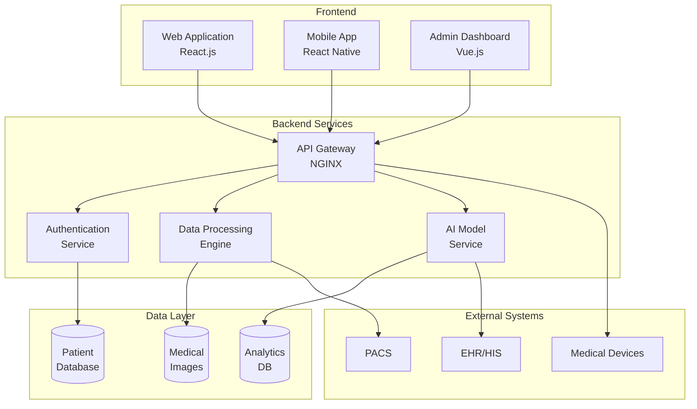
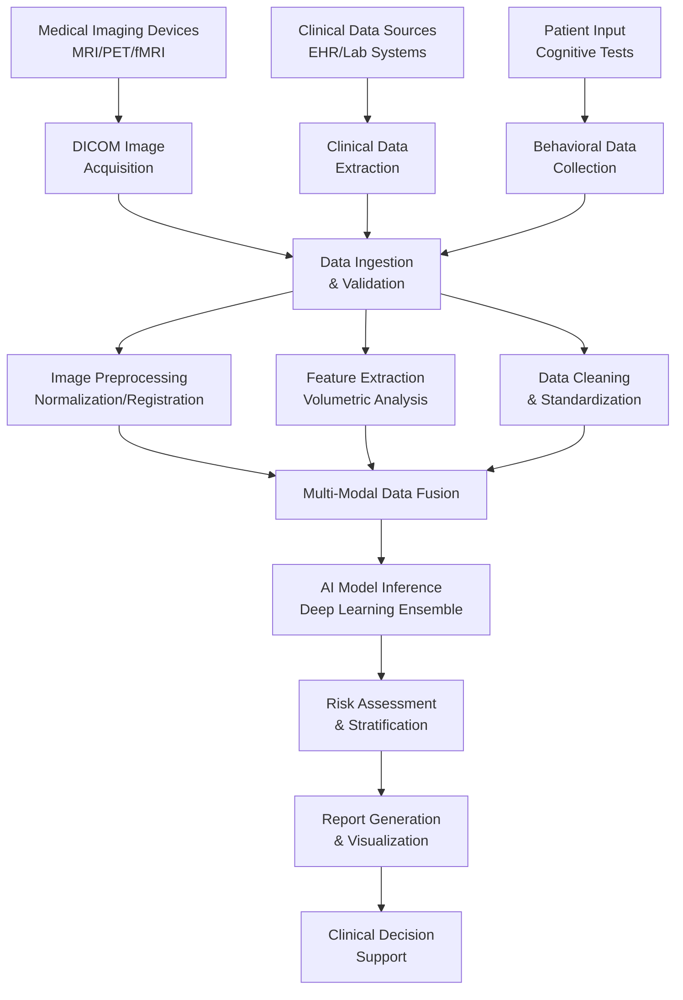
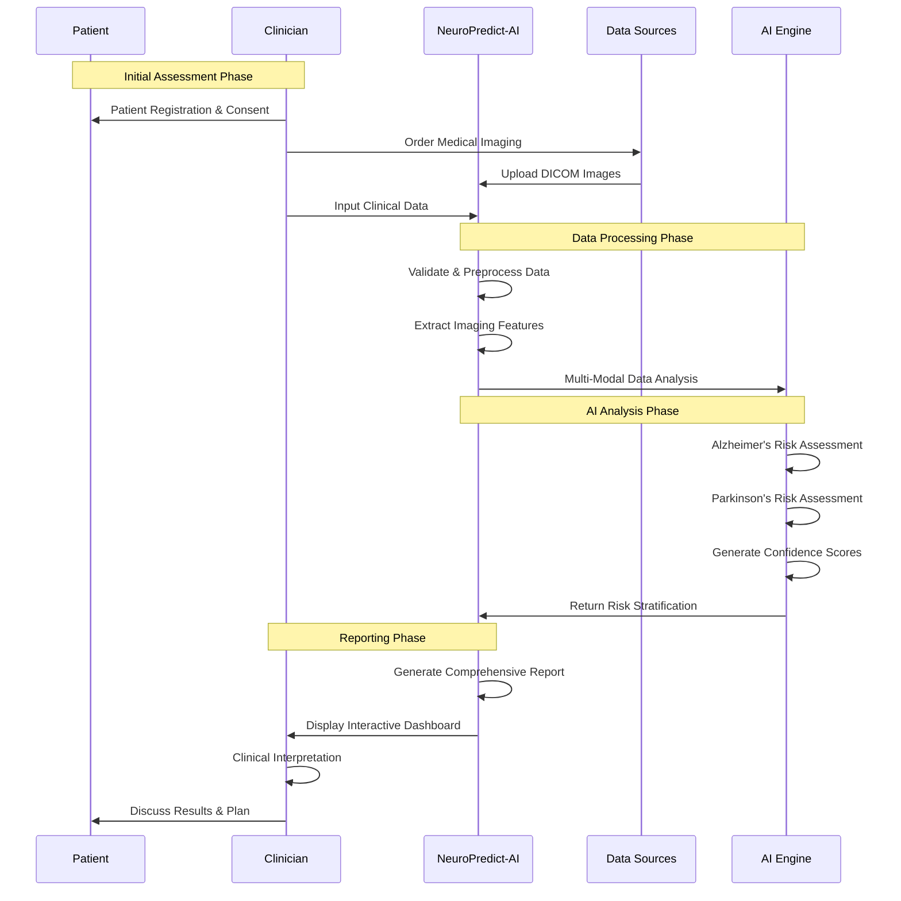
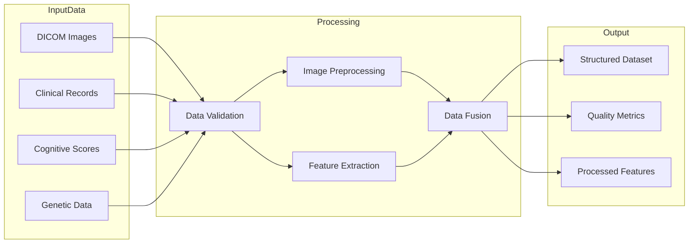
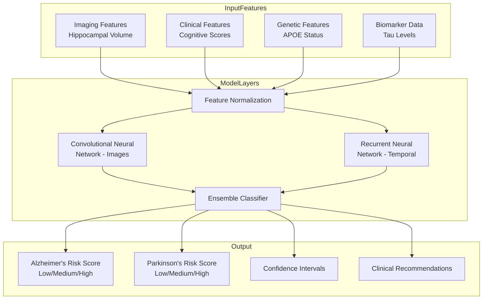
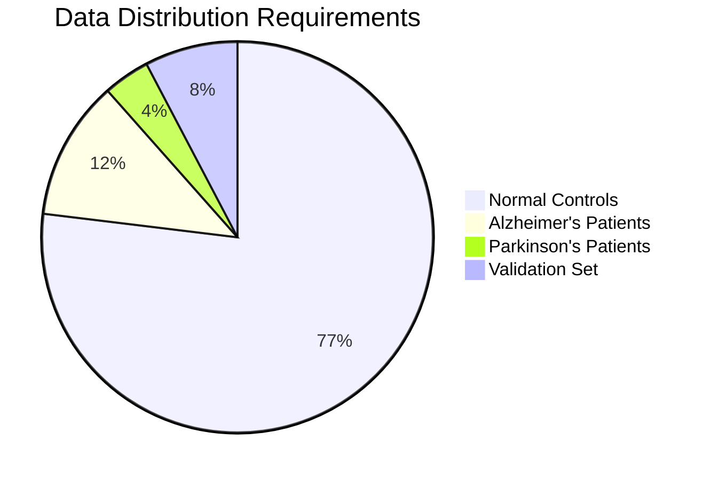
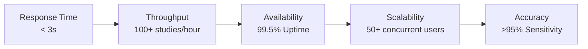
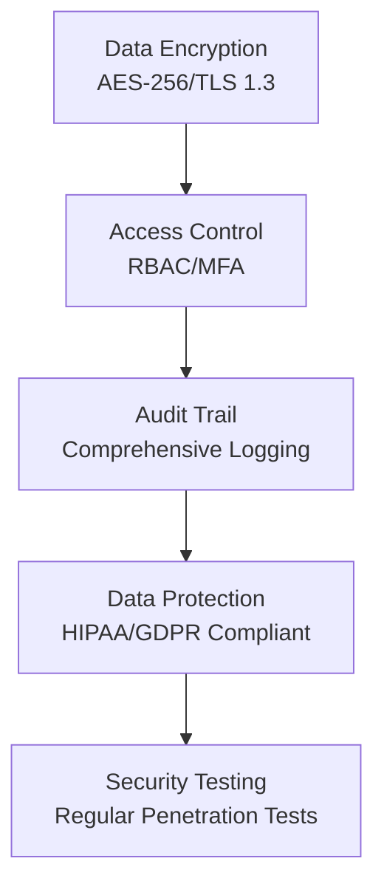
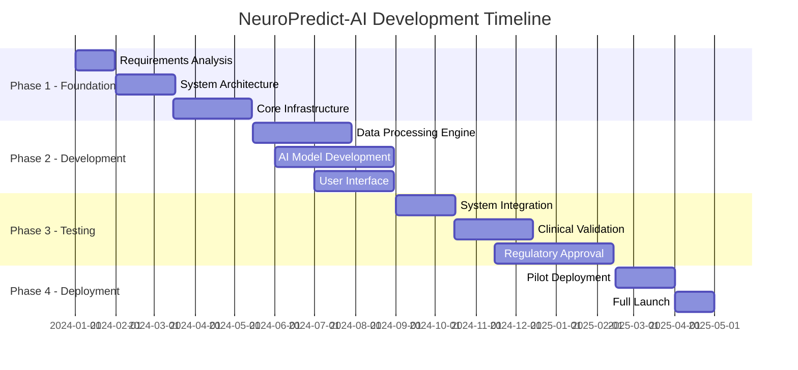
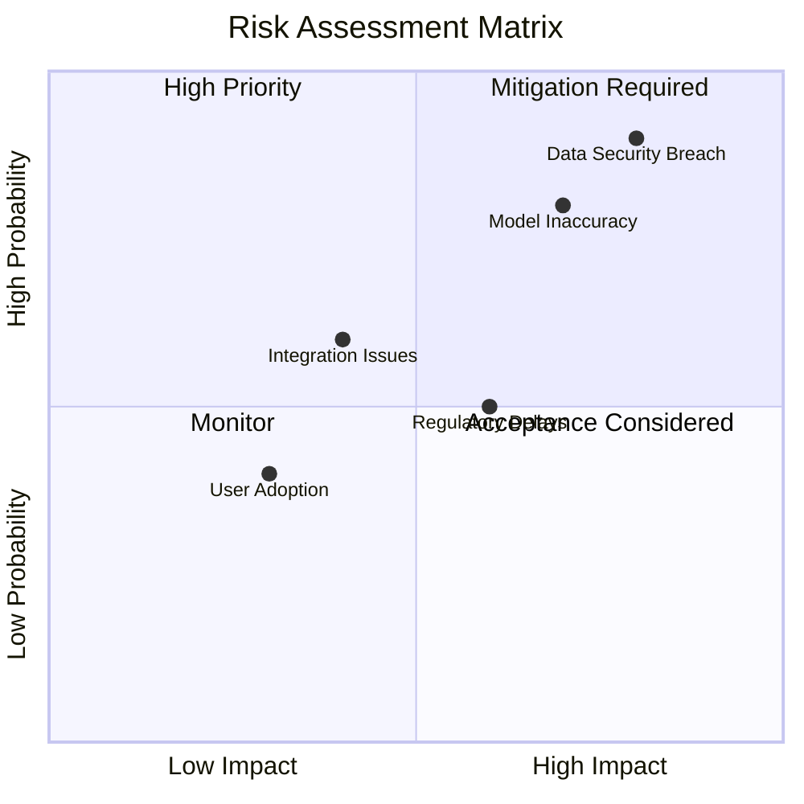

# Software Requirements Specification (SRS)
# NeuroPredict-AI: Alzheimer's and Parkinson's Prediction and Risk Assessment Software

## Document Control

| **Version** | **Date** | **Author** | **Changes** |
|-------------|----------|------------|-------------|
| 1.0 | 2024-11-20 | AI Development Team | Initial Release with Complete Diagrams |
| 1.1 | 2024-11-20 | AI Development Team | Added Architectural Details |

## 1. Introduction

### 1.1 Purpose
NeuroPredict-AI is an advanced clinical decision support system designed to assist healthcare professionals in early detection and risk assessment of Alzheimer's and Parkinson's diseases through artificial intelligence and multimodal data analysis.

### 1.2 Scope
The system provides AI-powered risk stratification and should be used as a supplementary tool alongside clinical judgment, not as a standalone diagnostic system.

### 1.3 Intended Audience
- Medical Professionals (Neurologists, Radiologists)
- Software Development Teams
- Project Stakeholders
- Quality Assurance Teams
- Regulatory Compliance Officers

## 2. System Architecture

### 2.1 High-Level System Architecture

### 2.2 Data Flow Architecture

### 2.3 Diagnosis Process Workflow

## 3. Detailed System Components

### 3.1 Data Processing Pipeline

### 3.2 AI Model Architecture

## 4. Functional Requirements

### 4.1 Core System Functions

| **Module** | **Function ID** | **Description** | **Priority** |
|------------|-----------------|-----------------|--------------|
| User Management | FR-01 | Role-based access control with multi-factor authentication | High |
| Data Management | FR-02 | Secure DICOM upload and clinical data integration | High |
| Image Processing | FR-03 | Automated preprocessing and quality assessment | High |
| AI Analysis | FR-04 | Multi-modal risk prediction with confidence scoring | High |
| Reporting | FR-05 | Comprehensive report generation with visualization | High |
| Integration | FR-06 | HL7/FHIR API for EHR/PACS integration | Medium |

### 4.2 Data Requirements Specification

## 5. Non-Functional Requirements

### 5.1 Performance Metrics

### 5.2 Security Framework

## 6. Implementation Timeline

### 6.1 Project Roadmap

## 7. Risk Assessment

### 7.1 Risk Matrix

## 8. Compliance & Regulatory Requirements

### 8.1 Standards Compliance
- **FDA**: 21 CFR Part 11, 510(k) Clearance
- **Medical Devices**: ISO 13485, IEC 62304
- **Data Protection**: HIPAA, GDPR, CCPA
- **Interoperability**: HL7 FHIR R4, DICOM

## 9. Conclusion

This SRS document provides comprehensive specifications for the NeuroPredict-AI system, ensuring alignment with clinical needs, technical requirements, and regulatory standards. The system architecture supports scalable, secure, and accurate risk assessment for neurodegenerative diseases.

---

**Document Approval**

| **Role** | **Name** | **Signature** | **Date** |
|----------|----------|---------------|----------|
| Project Sponsor | | | |
| Chief Medical Officer | | | |
| Lead Architect | | | |
| Quality Assurance | | | |

