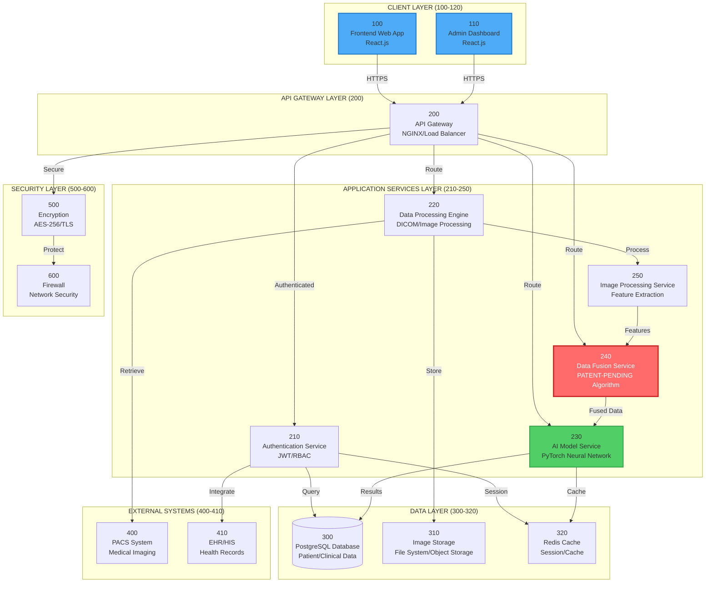

# Figure 1: System Architecture
# Patent Drawing Specification

## 📐 مشخصات نقشه

- **Figure Number**: 1
- **Title**: "Multi-Modal Clinical Decision Support System Architecture"
- **Type**: System Architecture Diagram
- **Page Orientation**: Landscape
- **Complexity**: High

---

## 🎨 دیاگرام Mermaid (Source)



---

## 📝 توضیحات Reference Numerals

### Client Layer (100-120)

**100 - Frontend Web Application**
- Technology: React.js, TypeScript
- Purpose: Main user interface for healthcare professionals
- Features: Patient management, prediction interface, reporting

**110 - Admin Dashboard**
- Technology: React.js, TypeScript
- Purpose: Administrative interface for system management
- Features: User management, system monitoring, analytics

### API Gateway Layer (200)

**200 - API Gateway / Load Balancer**
- Technology: NGINX
- Purpose: Request routing, load balancing, security
- Features: SSL termination, rate limiting, CORS handling

### Application Services Layer (210-250)

**210 - Authentication Service**
- Purpose: User authentication and authorization
- Features: JWT tokens, role-based access control, session management

**220 - Data Processing Engine**
- Purpose: Core data processing and validation
- Features: DICOM parsing, data validation, workflow orchestration

**230 - AI Model Service**
- Purpose: Deep learning model inference
- Features: Multi-modal neural network, risk prediction, confidence scoring

**240 - Data Fusion Service (Patent-Pending)**
- Purpose: Multi-modal data fusion algorithm
- Features: Weighted fusion, cross-modal correlation, conflict resolution
- **Note**: This is the core patent-pending innovation

**250 - Image Processing Service**
- Purpose: Medical image preprocessing and feature extraction
- Features: Normalization, skull stripping, volumetric analysis

### Data Layer (300-320)

**300 - PostgreSQL Database**
- Purpose: Primary data storage
- Contains: Patient records, medical data, predictions, audit logs

**310 - Image Storage**
- Purpose: Medical image file storage
- Format: DICOM files, processed images

**320 - Redis Cache**
- Purpose: Session storage and caching
- Features: Prediction result caching, session management

### External Systems (400-410)

**400 - PACS System**
- Purpose: Picture Archiving and Communication System
- Integration: DICOM protocol, medical imaging workflow

**410 - EHR/HIS**
- Purpose: Electronic Health Records / Hospital Information System
- Integration: HL7 FHIR, patient data exchange

### Security Layer (500-600)

**500 - Encryption Module**
- Purpose: Data encryption
- Features: AES-256 at rest, TLS 1.3 in transit

**600 - Firewall**
- Purpose: Network security
- Features: Access control, threat protection

---

## 🔄 جریان داده (Data Flow)

### 1. User Request Flow
```
User (100/110) → API Gateway (200) → 
Authentication (210) → Service (220/230/240) → 
Database (300) → Response → User
```

### 2. Data Processing Flow
```
Image Upload → Processing Engine (220) → 
Image Processing (250) → Feature Extraction → 
Data Fusion (240) → AI Model (230) → 
Results → Database (300)
```

### 3. External Integration Flow
```
PACS (400) → Processing Engine (220) → 
Database (300)

EHR (410) → Authentication (210) → 
Database (300)
```

---

## 🎨 Style Guide برای Patent Drawing

### رنگ‌ها:
- **Primary Components**: آبی (#4dabf7)
- **AI/ML Components**: سبز (#51cf66)
- **Patent-Pending**: قرمز (#ff6b6b) - Highlight
- **Data Storage**: خاکستری (#868e96)
- **Security**: نارنجی (#fd7e14)

### خطوط:
- **Data Flow**: خطوط مستقیم با پیکان
- **Relationship**: خطوط dashed برای optional
- **Thick Lines**: برای ارتباطات اصلی

### Layout:
- **Top**: Client Layer
- **Middle**: Application Services
- **Bottom**: Data Layer
- **Right Side**: External Systems
- **Bottom Border**: Security Layer

---

## ✅ چک‌لیست Patent Drawing

- [ ] تمام Reference Numerals واضح و خوانا
- [ ] خطوط با ضخامت مناسب (0.3-0.5mm)
- [ ] فونت اعداد حداقل 1.32mm
- [ ] رزولوشن 300+ DPI
- [ ] اندازه صفحه 21.6 × 27.9 cm
- [ ] Margins رعایت شده
- [ ] جریان داده واضح
- [ ] Labels واضح و کامل

---

**آماده برای ترسیم رسمی**: ✅  
**وضعیت**: Specification Complete  
**نسخه**: 1.0

