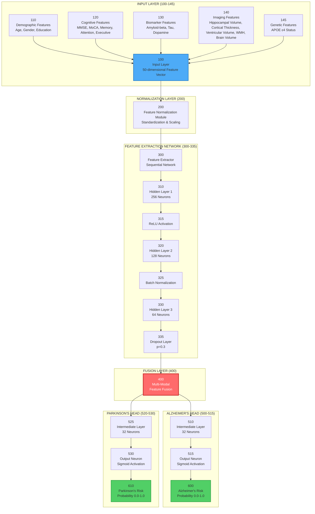

# Figure 2: Multi-Modal Neural Network Architecture
# Patent Drawing Specification

## 📐 مشخصات نقشه

- **Figure Number**: 2
- **Title**: "Multi-Modal Deep Learning Neural Network Architecture"
- **Type**: Neural Network Architecture Diagram
- **Page Orientation**: Portrait
- **Complexity**: Very High

---

## 🎨 دیاگرام Mermaid (Source)



---

## 📝 توضیحات جزئیات

### Input Layer (100-145)

**100 - Input Layer**
- **Dimensions**: 50 features
- **Format**: Normalized feature vector
- **Components**: 
  - Demographic (3 features)
  - Cognitive (5 features)
  - Biomarkers (3 features)
  - Genetic (1 feature)
  - MRI Features (5 features)
  - Imaging Deep Features (32 features)

**110 - Demographic Features**
- Age (normalized: 0-1)
- Gender (encoded: 0/1)
- Education Years (normalized: 0-1)

**120 - Cognitive Features**
- MMSE Score (normalized: 0-1)
- MoCA Score (normalized: 0-1)
- Memory Score (0-1)
- Attention Score (0-1)
- Executive Function Score (0-1)

**130 - Biomarker Features**
- Amyloid-beta Level (normalized: 0-1)
- Tau Protein Level (normalized: 0-1)
- Dopamine Level (normalized: 0-1)

**140 - Imaging Features**
- Hippocampal Volume (mm³, normalized)
- Cortical Thickness (mm, normalized)
- Ventricular Volume (mm³, normalized)
- White Matter Hyperintensities (normalized)
- Total Brain Volume (mm³, normalized)

**145 - Genetic Features**
- APOE ε4 Status (0 = negative, 1 = positive)

### Normalization Layer (200)

**200 - Feature Normalization Module**
- StandardScaler normalization
- Range: -3 to +3 standard deviations
- Handles missing values

### Feature Extraction Network (300-335)

**300 - Feature Extractor**
- Sequential neural network
- Input: 50 dimensions
- Output: 64 dimensions

**310 - Hidden Layer 1**
- **Neurons**: 256
- **Activation**: ReLU
- **Purpose**: Primary feature extraction

**315 - ReLU Activation**
- f(x) = max(0, x)
- Introduces non-linearity

**320 - Hidden Layer 2**
- **Neurons**: 128
- **Purpose**: Feature compression

**325 - Batch Normalization**
- Normalizes activations
- Stabilizes training
- Improves convergence

**330 - Hidden Layer 3**
- **Neurons**: 64
- **Purpose**: Final feature representation

**335 - Dropout Layer**
- **Rate**: 0.3 (30% dropout)
- **Purpose**: Prevents overfitting

### Fusion Layer (400)

**400 - Multi-Modal Feature Fusion**
- Combines all extracted features
- Input: 64-dimensional vector
- Output: 64-dimensional fused representation
- **Note**: Core innovation in multi-modal fusion

### Output Heads

**Alzheimer's Head (500-515)**
- **510**: Linear layer (64 → 32)
- **515**: Output layer (32 → 1) with Sigmoid
- **600**: Probability output (0.0-1.0)

**Parkinson's Head (520-530)**
- **525**: Linear layer (64 → 32)
- **530**: Output layer (32 → 1) with Sigmoid
- **610**: Probability output (0.0-1.0)

---

## 🔢 فرمول‌های ریاضی

### Forward Pass:

```
1. Input: x ∈ R^50
2. Normalization: x_norm = (x - μ) / σ
3. Hidden Layer 1: h1 = ReLU(W1 × x_norm + b1)
4. Hidden Layer 2: h2 = ReLU(W2 × BatchNorm(h1) + b2)
5. Hidden Layer 3: h3 = Dropout(ReLU(W3 × h2 + b3), p=0.3)
6. Fusion: f = h3
7. Alzheimer's: y_alz = σ(W_alz × ReLU(W_int1 × f + b_int1) + b_alz)
8. Parkinson's: y_park = σ(W_park × ReLU(W_int2 × f + b_int2) + b_park)
```

### Risk Stratification:

```
If y_alz < 0.3: Low Risk
If 0.3 ≤ y_alz < 0.7: Medium Risk
If y_alz ≥ 0.7: High Risk
```

---

## 🎨 Style Guide

### رنگ‌ها:
- **Input Layer**: آبی روشن (#4dabf7)
- **Normalization**: آبی (#339af0)
- **Feature Extraction**: بنفش (#845ef7)
- **Fusion Layer**: قرمز (#ff6b6b) - Highlight
- **Output Heads**: سبز (#51cf66)
- **Output**: سبز تیره (#2f9e44)

### Layout:
- **Top**: Input features (horizontal)
- **Middle**: Processing layers (vertical flow)
- **Bottom**: Output heads (parallel branches)

---

## 📐 ابعاد برای Patent Drawing

### Layout Dimensions:

```
Page: 21.6 cm × 27.9 cm
Drawing Area: 18.4 cm × 24.1 cm

Input Layer: Top 2 cm
Hidden Layers: Middle 10 cm (vertical)
Output: Bottom 4 cm

Width Distribution:
- Left 30%: Alzheimer's Head
- Right 30%: Parkinson's Head
- Center 40%: Main Network
```

---

## ✅ چک‌لیست

- [ ] تمام لایه‌ها با Reference Numerals
- [ ] اتصالات بین لایه‌ها واضح
- [ ] تعداد neurons مشخص
- [ ] Activation functions مشخص
- [ ] جریان داده واضح (top to bottom)
- [ ] Output heads به صورت parallel
- [ ] فرمول‌های ریاضی در توضیحات

---

**آماده برای ترسیم رسمی**: ✅  
**وضعیت**: Specification Complete  
**نسخه**: 1.0

