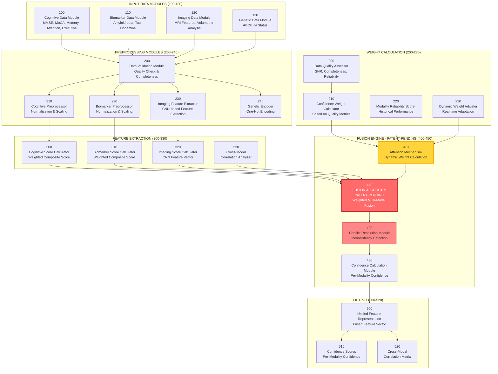

# Figure 3: Multi-Modal Data Fusion System
# Patent Drawing Specification

## 📐 مشخصات نقشه

- **Figure Number**: 3
- **Title**: "Multi-Modal Data Fusion Algorithm Architecture"
- **Type**: Algorithm Architecture Diagram
- **Page Orientation**: Portrait
- **Complexity**: Very High
- **Patent Status**: ⚠️ **PATENT-PENDING CORE INNOVATION**

---

## 🎨 دیاگرام Mermaid (Source)



---

## 📝 توضیحات الگوریتم Patent-Pending

### الگوریتم Data Fusion (440)

**این الگوریتم جزء اصلی اختراع است:**

```python
def patent_pending_fusion_algorithm(cognitive_score, biomarker_score, 
                                    imaging_score, cognitive_conf, 
                                    biomarker_conf, imaging_conf):
    """
    PATENT-PENDING: Multi-Modal Data Fusion Algorithm
    
    Innovation Points:
    1. Dynamic weight calculation based on data quality
    2. Cross-modal correlation analysis
    3. Conflict resolution mechanism
    4. Confidence-weighted fusion
    """
    
    # Step 1: Calculate attention weights
    weights = attention_mechanism(cognitive_conf, biomarker_conf, imaging_conf)
    
    # Step 2: Calculate cross-modal correlations
    correlations = cross_modal_correlation(cognitive_score, biomarker_score, imaging_score)
    
    # Step 3: Detect conflicts
    conflicts = detect_conflicts(cognitive_score, biomarker_score, imaging_score)
    
    # Step 4: Resolve conflicts
    resolved_scores = resolve_conflicts(scores, conflicts, correlations)
    
    # Step 5: Weighted fusion
    fused_score = weighted_fusion(resolved_scores, weights, correlations)
    
    # Step 6: Calculate overall confidence
    overall_confidence = aggregate_confidence(confidences, weights)
    
    return fused_score, overall_confidence
```

### Reference Numerals:

**Input Data Modules (100-130):**
- **100**: Cognitive Data Module
- **110**: Biomarker Data Module
- **120**: Imaging Data Module
- **130**: Genetic Data Module

**Preprocessing (200-240):**
- **200**: Data Validation Module
- **210**: Cognitive Preprocessor
- **220**: Biomarker Preprocessor
- **230**: Imaging Feature Extractor
- **240**: Genetic Encoder

**Feature Extraction (300-330):**
- **300**: Cognitive Score Calculator
- **310**: Biomarker Score Calculator
- **320**: Imaging Score Calculator
- **330**: Cross-Modal Correlation Analyzer

**Fusion Engine - Patent-Pending (400-450):**
- **410**: Attention Mechanism (Dynamic Weight Calculation)
- **440**: **FUSION ALGORITHM** (PATENT-PENDING)
- **420**: Conflict Resolution Module
- **430**: Confidence Calculation Module

**Weight Calculation (200-230):**
- **200**: Data Quality Assessor
- **210**: Confidence Weight Calculator
- **220**: Modality Reliability Scorer
- **230**: Dynamic Weight Adjuster

**Output (500-520):**
- **500**: Unified Feature Representation
- **510**: Confidence Scores per Modality
- **520**: Cross-Modal Correlation Matrix

---

## 🔬 جزئیات الگوریتم Fusion (Patent-Pending)

### Step 1: Attention Mechanism (410)

**Dynamic Weight Calculation:**

```
Wi = (Qi × Ci × Ri) / Σ(Qj × Cj × Rj)

Where:
- Wi = Weight for modality i
- Qi = Quality score for modality i
- Ci = Confidence for modality i
- Ri = Reliability score for modality i
```

### Step 2: Cross-Modal Correlation (330)

**Correlation Analysis:**

```
Correlation(i,j) = Cov(Score_i, Score_j) / (σ_i × σ_j)

Detects:
- Positive correlations (reinforcing signals)
- Negative correlations (conflicting signals)
```

### Step 3: Conflict Resolution (420)

**Conflict Detection:**

```
If |Score_i - Score_j| > Threshold:
    Conflict = True
    Resolution = Weighted Average with Lower Confidence Penalty
```

### Step 4: Weighted Fusion (440)

**Final Fusion Formula:**

```
Fused_Score = Σ(Wi × Si × (1 - Conflict_Penalty_i))

Where:
- Si = Normalized score for modality i
- Conflict_Penalty_i = Penalty based on conflict severity
```

---

## 🎨 Style Guide

### رنگ‌ها:
- **Patent-Pending Algorithm**: قرمز (#ff6b6b) - Highlight بسیار قوی
- **Attention Mechanism**: زرد (#ffd43b) - Highlight
- **Input Modules**: آبی (#4dabf7)
- **Processing**: بنفش (#845ef7)
- **Output**: سبز (#51cf66)

### Layout:
- **Top**: Input Data Modules
- **Upper Middle**: Preprocessing
- **Middle**: Feature Extraction
- **Lower Middle**: Fusion Engine (PATENT-PENDING - Highlight)
- **Bottom**: Output

---

## 📐 ابعاد برای Patent Drawing

### Highlight Requirements:

**Fusion Algorithm (440) باید:**
- با رنگ قرمز Bold مشخص شود
- Border ضخیم‌تر (4px)
- Label "PATENT-PENDING" واضح
- در مرکز توجه قرار گیرد

---

## ✅ چک‌لیست

- [ ] Fusion Algorithm به وضوح مشخص شده
- [ ] "PATENT-PENDING" label واضح
- [ ] تمام مراحل الگوریتم شماره‌گذاری شده
- [ ] فرمول‌های ریاضی در توضیحات
- [ ] جریان داده واضح
- [ ] Conflict Resolution مشخص
- [ ] Attention Mechanism Highlight شده

---

**آماده برای ترسیم رسمی**: ✅  
**وضعیت**: Specification Complete  
**Patent Status**: ⚠️ **CORE PATENT-PENDING INNOVATION**  
**نسخه**: 1.0

