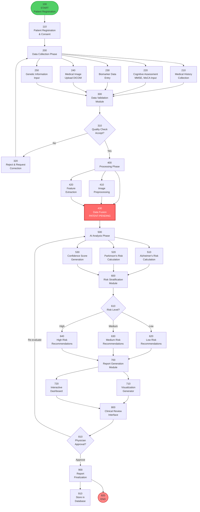

# Figure 4: Clinical Decision Support Workflow
# Patent Drawing Specification

## 📐 مشخصات نقشه

- **Figure Number**: 4
- **Title**: "Clinical Decision Support Workflow Diagram"
- **Type**: Workflow/Process Flow Diagram
- **Page Orientation**: Portrait
- **Complexity**: High

---

## 🎨 دیاگرام Mermaid (Source)

---

## 📝 Reference Numerals

### Initial Phase (100-110)
- **100**: START - Patient Registration
- **110**: Patient Registration & Consent Module

### Data Collection Phase (200-250)
- **200**: Data Collection Phase
- **210**: Medical History Collection
- **220**: Cognitive Assessment Input
- **230**: Biomarker Data Entry
- **240**: Medical Image Upload (DICOM)
- **250**: Genetic Information Input

### Validation Phase (300-320)
- **300**: Data Validation Module
- **310**: Quality Check Decision Point
- **320**: Reject & Request Correction

### Processing Phase (400-430)
- **400**: Processing Phase
- **410**: Image Preprocessing Module
- **420**: Feature Extraction Module
- **430**: Data Fusion Module (PATENT-PENDING)

### AI Analysis Phase (500-530)
- **500**: AI Analysis Phase
- **510**: Alzheimer's Risk Calculation
- **520**: Parkinson's Risk Calculation
- **530**: Confidence Score Generation

### Output Phase (600-640)
- **600**: Risk Stratification Module
- **610**: Risk Level Decision Point
- **620**: Low Risk Recommendations
- **630**: Medium Risk Recommendations
- **640**: High Risk Recommendations

### Report Phase (700-720)
- **700**: Report Generation Module
- **710**: Visualization Generator
- **720**: Interactive Dashboard

### Review Phase (800-920)
- **800**: Clinical Review Interface
- **810**: Physician Approval Decision Point
- **900**: Report Finalization
- **910**: Store in Database
- **920**: END

---

**آماده برای ترسیم رسمی**: ✅  
**وضعیت**: Specification Complete  
**نسخه**: 1.0

